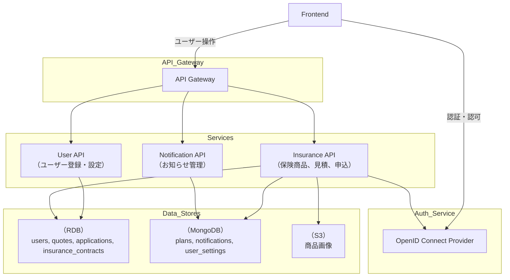

# 🎯 MVP定義書：個人保険管理システム（Microservices）

## 1. プロダクト概要

- 個人向け保険契約管理システム。ユーザーがWeb上で保険商品を閲覧・見積もり・申込・契約管理できる最低限の機能を提供する。
- マイクロサービスアーキテクチャに基づいて構築し、実開発に即した学習を目的とする。

---

## 2. ターゲットユーザー（仮定）

- 保険加入を検討中の個人ユーザー
- PCやスマホで簡単に保険契約を行いたいユーザー

---

## 3. MVPゴール

- 会員登録およびログインができる
- ユーザーが保険商品を閲覧できる
- ユーザーが見積もりを取得できる
- ユーザーが保険契約を申し込める
- 契約情報をWeb上で確認できる
- システムはクラウド（AWS）上に公開・運用されている

---

## 4. MVP機能一覧

### 🔐 ユーザー管理機能
- ユーザー登録（メール・パスワード）
- ログイン／ログアウト（まずはJWT、後々OpenID）
- プロフィール取得（編集機能はMVP外）

### 📦 商品管理機能
- 保険商品一覧表示（商品名・金額・補償内容）※保険商品の詳細は後述

### 💰 見積もり機能（保険料シミュレーション）
- 年齢や保険期間に基づいた保険料試算（例：定率・定額方式）
- 結果表示（商品ごとの保険料例）
- 簡易入力（年齢・性別・契約年数）

### 📄 契約管理機能
- 保険契約申込（商品選択→契約作成）
- 契約履歴一覧表示（自身の契約情報のみ）

### ☁️ クラウド展開
- 各サービスはAWS ECS Fargate上に構築
- データベースはAmazon RDS for PostgreSQL
- フロントエンドはS3 + CloudFrontでホスティング
- CI/CDを用いた自動デプロイ

---

## 5. 使用技術スタック

| 分類         | 技術                          | 用途                             |
|--------------|-------------------------------|----------------------------------|
| フロントエンド | React, Vite, Tailwind CSS     | SPA構成                          |
| API通信       | REST API                       | サービス間通信                    |
| バックエンド   | Python, FastAPI                | 各マイクロサービス構築           |
| 認証認可       | OpenID                             | 自前で認証トークン管理            |
| データベース   | PostgreSQL                     | 各サービスごとに分離              |
| インフラ       | AWS ECS Fargate, RDS, S3       | サービスのホスティング            |
| IaC（任意）   | Terraform                      | クラウド構成管理（任意）         |
| ローカル開発   | Docker, docker-compose         | コンテナベースの開発環境          |
| CI/CD        | GitHub Actions                 | Lint, Test, Deploy の自動化       |

---

## 6. システム構成図（簡略）

---

## 7. テスト方針（MVPスコープ）

| レイヤー     | 内容                                 |
|--------------|--------------------------------------|
| 単体テスト    | 各マイクロサービスのビジネスロジック単体確認 |
| APIテスト     | FastAPI の REST エンドポイント確認     |
| E2Eテスト     | フロント〜バック通しで動作確認         |
| 静的解析      | isort / black / flake8 を使用         |

---

## 8. 除外事項（MVP対象外）

- 決済処理（クレカ、銀行引き落とし）
- 商品管理画面（Admin UI）
- 通知機能（メール・SMS・LINEなど）
- アカウント情報編集・削除
- 契約解約・変更機能
- SLAや高可用性・耐障害設計

---

## 9. 成果物

- 開発環境（GitLab, Harbor）
- GitLab リポジトリ（プライベート）
- システム構成図、ER図、API仕様書（Markdown形式）
- Webで動作する公開デモ（CloudFront or EC2）

---

## 10. 開発スケジュール（例）

| フェーズ       | 内容                              | 期間目安     |
|----------------|-----------------------------------|--------------|
| 構想・設計     | ドメイン定義、構成設計            | 1週間        |
| 基盤構築       | 各サービスのひな形とDocker環境構築 | 1〜2週間     |
| MVP開発        | API + フロント機能開発            | 2〜3週間     |
| クラウド展開    | AWS環境構築、CI/CD整備            | 1〜2週間     |
| テスト・改善   | 単体／統合テスト、バグ修正         | 1週間        |

---

## 11. レベルアップメモ
- おすすめ商品表示(GET /plans api)

## ✅ 最終ゴール

以下を満たすことをMVP完了の定義とする：

- ユーザーがWeb上で保険商品を選んで見積もり・契約できる
- 契約情報が一覧で確認できる
- システムはAWS上に公開済み
- GitHubに実装とドキュメントが揃っている
  
  

# 🧰 マイクロサービス開発ツール一覧（学習プロジェクト用）

## ✅ 基本開発ツール

| カテゴリ                   | ツール・技術               | 用途・補足 |
|----------------------------|-----------------------------|------------|
| **ソース管理**             | GitLab                      | Gitリポジトリ管理・CI/CD統合 |
| **CI/CD**                 | GitLab CI                   | Lint → Test → Build → Push 自動化 |
| **コンテナ実行**           | Docker                      | ローカルビルド・検証 |
| **コンテナスキャン**       | Trivy                       | 脆弱性スキャン（Harborとも連携） |
| **イメージレジストリ**     | Harbor                      | コンテナイメージの管理とスキャン |
| **オーケストレーション**   | Kubernetes (K8s)            | サービス管理・本番構成想定 |
| **サービス起動補助**       | Docker Compose              | ローカルで複数サービスを一括起動 |
| **開発IDE**               | VSCode                      | プログラミング・拡張が豊富 |
| **コードフォーマット／静的解析** | `Black`, `isort`, `flake8`（Python） `ESLint`, `Prettier`（JavaScript） | コーディング規約の統一・ミス防止 |
| **DB管理**               | DBeaver / pgAdmin           | DBスキーマ確認・デバッグ |
| **APIテスト／確認**        | Postman / Hoppscotch        | APIの動作確認・自動テスト可能 |
| **ドキュメント管理**       | MkDocs / GitLab Wiki / Notion | アーキ構成・API仕様の共有に |
| **モニタリング／トレース** | Prometheus（メトリクス） Grafana（可視化） OpenTelemetry（トレース） | 運用監視：**MVP構築後に導入予定** |

---

## ✨ オプション（必要に応じて検討）

| ツール・技術          | 補足 |
|-----------------------|------|
| Tilt / Skaffold       | Kubernetes向けの開発ループ高速化 |
| Devcontainer（VSCode）| 開発環境のコンテナ化（再現性UP） |
| OpenAPI Generator     | API定義からコード自動生成 |
| Loki + Grafana        | ログ集約・可視化に（軽量ログ基盤） |

# 📦 個人保険システムの機能一覧（マイクロサービス構成想定）

## ✅ MVPに含まれる機能（最小実用機能）

### ユーザー関連
- ユーザー登録（サインアップ）
- ユーザーログイン（JWT認証）
- ユーザー情報の取得・更新

### 保険商品関連
- 保険商品の一覧取得
- 保険商品の詳細取得
- 保険商品の登録（管理者向け）

### 申込・見積もり関連
- 保険見積もり作成
- 見積もり結果の取得
- 保険申込の作成
- 申込履歴の取得

### クラウド／運用対応
- Docker + Kubernetes によるマイクロサービス実行
- GitLab CI によるビルド & デプロイ
- Trivy によるコンテナスキャン
- OpenAPIベースのAPI仕様管理（開発効率向上）

---

## 🚀 MVP後に検討する機能（発展・実践向け）

### 通知・連携機能
- メール通知（見積もり・申込受付）
- LINE通知（任意）
- 外部連携API（保険会社や代理店）

### 管理者機能
- 管理画面（保険商品の追加・変更・販売停止）
- 申込データの一覧／CSV出力
- 契約状況の分析・ダッシュボード表示
- Keycloak連携データの保持方針

### 運用監視・ログ
- OpenTelemetry によるトレース収集
- Prometheus + Grafana によるメトリクス監視
- Loki 等によるログ収集・可視化

---

## 💡補足
- 各機能は独立したマイクロサービスとして構成可能（例：user-service, quote-service など）
- APIはOpenAPI (Swagger) で仕様管理し、コード生成も可能
- MVP完了後はCI/CD、監視、セキュリティ面の強化を段階的に実施予定

#　開発スタート

# ✅ MVP機能一覧（個人保険システム）

## 🔐 ユーザー関連機能（User Service）
- [x] ユーザー登録（会員登録）
- [x] ログイン（JWT発行）
- [x] プロフィール情報の取得

## 📄 保険商品機能（Policy Service）
- [x] 保険商品の一覧取得
- [x] 保険商品の詳細取得

## 📊 見積もり機能（Quote Service）
- [x] 保険見積もりの取得（試算）
- [x] 見積もり詳細の取得

## 📝 申込機能（Application Service）
- [x] 保険申込の作成（見積もりに基づく申込）
- [x] 保険申込履歴の一覧取得

## 💳 支払い機能（※MVP範囲には未実装）
- [ ] 支払い状況の確認（将来の拡張候補）
- [ ] 支払い情報の登録（クレカや口座）

## 🛠️ 補足
- 認証: JWT（トークンベース認証）
- 各機能は独立したマイクロサービスとして構成
- APIはREST形式で設計

# 販売する保険についての説明

## 個人年金保険

### 特徴

- 保険料は定額
- 払込期間満了後、予定利率をかけた金額が払い戻されます。
- 予定利率は以下のタイミングで変わります。
    - 契約時
    - 契約から15年後
    - その後10年おきに変更可能
- 予定利率には最低保証あり(0.5%)
- 解約返戻金は10年で元本が復活します
- 予定利率を保証するために、架空の保険会社が裏で運用を頑張ります。
- 保険契約者が死亡した際は払込済額を返金する
- 年金受取人が受給中に死亡した場合は、代理受取人に年金を受給します。
- 健康情報は告知不要です。
- 加入は20歳以上、50歳未満が条件です。

### 見積もりに必要な条件

- 生年月日
- 性別 男か女
- 月額保険料 (選択範囲は¥50,000 - ¥10,000 で¥1,000単位)
- 払込期間(15年以上必須で、65歳までがMAX)
- 個人年金保険料税制適格特約 つけるかつけないか

### 見積もり結果として必要な情報

- 見積もり結果の前提情報
    - 予定契約日（毎月1日のみ）ex) 6月2日に契約申し込みを出したら、7月1日からの契約となる
    - 契約時の予定利率
    - 払込保険料総額
    - 保険料払込期間
    - 年金開始年齢
    - 年間の所得控除額
    - 所得税・住民税への影響の目安
- 見積もり結果①（想定予定利率が上回るケース）
    - 想定予定利率
    - 累計額
    - 年金の年額
    - 一括受取額
    - 15年払込時の払い戻し金額と払戻率
- 見積もり結果②（想定予定利率が変わらないケース）
    - 想定予定利率
    - 累計額
    - 年金の年額
    - 一括受取額
    - 15年払込時の払い戻し金額と払戻率
- 見積もり結果③（想定予定利率が最低保証になるケース）
    - 想定予定利率
    - 累計額
    - 年金の年額
    - 一括受取額
    - 15年払込時の払い戻し金額と払戻率

### 申し込みに必要な情報

- 生年月日
- 性別 男か女
- 月額保険料 (選択範囲は¥50,000 - ¥10,000 で¥1,000単位)
- 払込期間(15年以上必須で、65歳までがMAX)
- 個人年金保険料税制適格特約 つけるかつけないか
- 予定契約日（毎月1日のみ）
- 契約時の予定利率
- 年金の受け取り方法（一括か年金か）
- 受取開始年齢（一括の場合は一括で受け取る年齢）
- 受取回数（一括の場合は１回）
- 代理受取人情報（複数可能）

### 運用条件（架空）

- 国債50%、社債30%、株式20%

## 学資保険

### 特徴

- 教育資金準備用の積立型保険
- 保険料は定額＆選択式（利率固定・元本保証型）
- 払込期間は子どもが15歳になるまでで一律
- 満期金ではなく、祝金を以下の4回に分けて受け取り
- 子どもが18歳・19歳・20歳・21歳のときに均等給付
- 保険料の払込方法は月払 or 年払（12ヶ月分一括）or 全期前納（契約時に全額払込）から選択
- 契約者が死亡または高度障害状態になった場合は、その後の保険料が全額免除（保障継続）
- 加入対象は子どもの年齢が「出生〜2歳未満」
- 契約者の健康告知は必要（簡易型）
- 税制優遇あり（生命保険料控除）
- 解約時には解約返戻金あり（元本割れの可能性あり）

### 見積もりに必要な条件

- 子どもの生年月日（出生〜2歳未満）
- 契約者の生年月日・性別
- 保険料額 
    - 月額：10,000円／15,000円／20,000円
    - 年額：120,000円／180,000円／240,000円
    - 一括前納額：契約年齢に応じて自動計算
- 払込方法（以下から選択）
    - 月払い
    - 年払い
    - 全期前納

### 見積もり結果として必要な情報

- 見積もり前提情報
- 契約日（毎月1日開始）
- 払込保険料総額
- 払込期間（〜子ども15歳）
- 保険料払込方法
- 年間の控除対象額（税制）
- 所得税・住民税への影響の目安（参考）
- 総払込額
- 総受取額（祝金合計）
- 各年の祝金額（均等）
- 返戻率（％）
- 解約返戻金（経過年数別の目安）

### 申し込みに必要な情報

- 子どもの生年月日
- 契約者の氏名、生年月日、性別
- 保険料額（10,000円／15,000円／20,000円）
- 払込方法（月払い／年払い／全期前納）
- 予定契約日（毎月1日のみ）
- 受取人情報（通常は子ども）
- 祝金受取方法（銀行振込予定）

### 運用条件（架空）

- 運用割合：国債60%、社債20%、その他安全資産20%
- 利率：年1.8%固定（元本保証）
- 解約返戻金は以下の水準：
- 払込5年未満：70〜80%
- 払込5年：元本保証
- 払込完了後：返戻率130%