# DB設計

## DDL出力用 プロンプトテンプレート（mermaid & openapi => DDL）

あなたは、モバイルアプリおよびマイクロサービスアーキテクチャ、データベース管理に精通したプロフェッショナルなソフトウェア、データベースアーキテクトです。

以下に示すMermaid形式のシーケンス図と、Openapiファイルをもとに、RDB(PostgreSQL)およびMongoDBの**DDL(マークダウン形式)**を出力してください。出力対象は、Mermaid形式のシーケンス図中に登場する各DB（MongoDB (商品データ)やRDB (見積もりデータ)など）です。

- 各DDLに対して、説明文を入れてわかりやすくしてください。
- 出力するDDLになった理由(データ形式や、項目)の説明を別途出力してください。

もし前提条件や不明点がある場合は、出力前に**質問リストを提示**してください。

## ER図



## DDLテンプレート

### 🟦 PostgreSQL用 DDL（マークダウン形式）

* 見積もり情報を格納するテーブル

```sql
DROP TABLE IF EXISTS quotes;

CREATE TABLE quotes (
    quote_id UUID PRIMARY KEY,                      -- 見積もりID
    user_id TEXT NOT NULL,                          -- ユーザーID

    -- ユーザーの契約条件
    birth_date DATE NOT NULL,                       -- 生年月日
    gender TEXT NOT NULL,                           -- 性別
    monthly_premium INTEGER NOT NULL,               -- 月額保険料
    payment_period_years INTEGER NOT NULL,          -- 支払い年数
    tax_deduction_enabled BOOLEAN NOT NULL,         -- 税制適格特約の有無

    -- 見積もり計算結果
    contract_date DATE NOT NULL,                    -- 契約開始日
    contract_interest_rate FLOAT NOT NULL,          -- 契約利率
    total_paid_amount INTEGER NOT NULL,             -- 支払総額
    pension_start_age INTEGER NOT NULL,             -- 年金開始年齢
    annual_tax_deduction INTEGER NOT NULL,          -- 年間控除額

    -- シナリオ（jsonb配列）
    scenario_data JSONB NOT NULL,                   -- 複数の利率シナリオデータ

    -- ステータス
    quote_state VARCHAR(32) DEFAULT 'none',         -- 見積もり状態（none, applied など）

    -- レコード作成日
    created_at TIMESTAMP DEFAULT CURRENT_TIMESTAMP  -- 作成日時
);
```

* 申し込み情報を格納するテーブル

```sql
DROP TABLE IF EXISTS applications;

CREATE TABLE applications (
    application_id UUID PRIMARY KEY,                   -- 申込ID（UUID形式で一意に識別）

    quote_id UUID NOT NULL,                            -- 対象となる見積もりID（quotes.quote_idを参照）
    user_id UUID NOT NULL,                             -- 申込ユーザーID（Keycloakのsubと対応）

    -- ステータス管理
    application_status VARCHAR(32) DEFAULT 'none',     -- 申込状態（none, applied, cancelled, etc）

    -- ユーザー同意とタイムスタンプ
    user_consent BOOLEAN NOT NULL,                     -- 利用規約や約款への同意取得フラグ
    applied_at TIMESTAMP WITHOUT TIME ZONE NOT NULL,   -- 申込日時
    deleted_at TIMESTAMP WITHOUT TIME ZONE             -- 削除日時（キャンセル・取り消し時など、NULL許容）
);
```

```sql
-- 保険契約情報を保持するテーブル
CREATE TABLE contracts (
    contract_id VARCHAR(64) PRIMARY KEY,
    application_id VARCHAR(64) NOT NULL REFERENCES applications(application_id),
    user_id VARCHAR(64) NOT NULL,
    contract_start_date DATE NOT NULL,
    contract_end_date DATE,
    plan_id VARCHAR(64) NOT NULL,
    agreed_rate FLOAT NOT NULL,
    agreed_premium INTEGER NOT NULL,
    contract_terms TEXT
);
```

---

### 🟩 MongoDB用 スキーマ定義例（JSON風）

**保険商品情報**
```javascript
use insurance;

db.plans.insertMany([
   {
     plan_id: "pension001",
     name: "個人年金保険",
     description: "老後の生活資金を確保するための保険です。",
     image_key: "pension001.jpg"
   },
   {
     plan_id: "education001",
     name: "学資保険",
     description: "お子様の教育資金を準備するための保険です。",
     image_key: "education001.jpg"
   }
]);
```

**金利データ**

```javascript
use rate_db;

db.interest_rates.insertMany([
  {
    "product_type": "pension",
    "rate_type": "contract",
    "rate": 1.2,
    "start_date": ISODate("2025-01-01"),
    "end_date": ISODate("2030-12-31"),
    "guaranteed_minimum_rate": 0.5
  },
  {
    "product_type": "pension",
    "rate_type": "contract",
    "rate": 1.3,
    "start_date": ISODate("2031-01-01"),
    "end_date": ISODate("2045-12-31"),
    "guaranteed_minimum_rate": 0.5
  }
]);
```

---

### 🧠 スキーマ設計の背景と選定理由

#### ✅ PostgreSQL（RDB）採用理由

| テーブル           | 理由                                   |
| -------------- | ------------------------------------ |
| `quotes`       | トランザクション管理が必要（計算値、履歴の一貫性保持）          |
| `applications` | 申込ステータス・同一ユーザーの複数申込を整合的に管理する必要があるため  |
| `contracts`    | 明確な契約履歴・期間管理・金額情報が必要なため。RDBで整合性保証が容易 |

* 各テーブルには `user_id` を保持し、Keycloakとのユーザー識別連携を担保
* `interest_rate_snapshot` など、変動する参照情報は冗長に保持して一貫性を確保

---

#### ✅ MongoDB（NoSQL）採用理由

| コレクション                      | 理由                                    |
| --------------------------- | ------------------------------------- |
| `plans`                     | 商品情報が階層・配列構造（利率履歴含む）を持ち、柔軟性が求められる     |
| `notifications`             | 一括配信で多数の読み込みアクセスがあるため、スキーマの柔軟性と拡張性が必要 |
| `user_notifications_status` | ユーザーごとに「お知らせの既読一覧」を持つため、更新・検索の柔軟性が必要  |
| `user_settings`             | 設定項目が今後変化・増加する可能性があり、スキーマレスな保存が望ましい   |

---