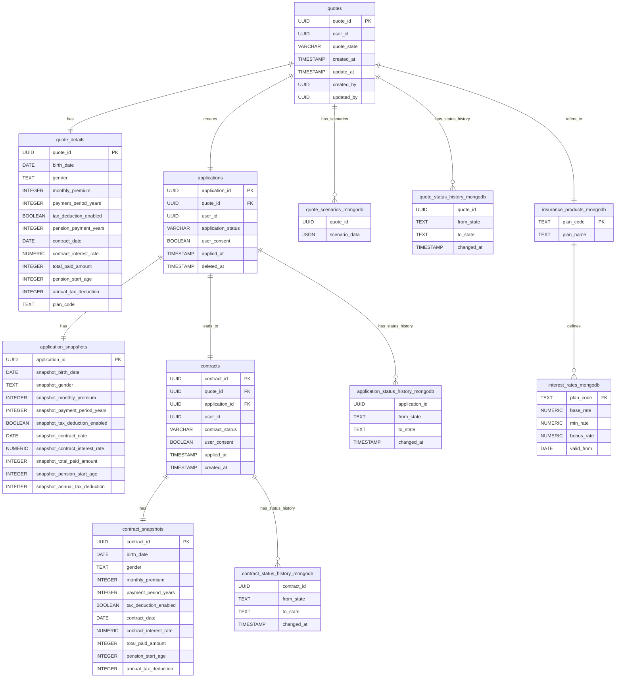

# DB構成

## ER図

```mermaid
erDiagram

quotes {
    UUID quote_id PK
    UUID user_id
    VARCHAR quote_state
    TIMESTAMP created_at
    TIMESTAMP update_at
    UUID created_by
    UUID updated_by
}

quote_details {
    UUID quote_id PK
    DATE birth_date
    TEXT gender
    INTEGER monthly_premium
    INTEGER payment_period_years
    BOOLEAN tax_deduction_enabled
    INTEGER pension_payment_years
    DATE contract_date
    NUMERIC contract_interest_rate
    INTEGER total_paid_amount
    INTEGER pension_start_age
    INTEGER annual_tax_deduction
    TEXT plan_code
}

applications {
    UUID application_id PK
    UUID quote_id FK
    UUID user_id
    VARCHAR application_status
    BOOLEAN user_consent
    TIMESTAMP applied_at
    TIMESTAMP deleted_at
}

application_snapshots {
    UUID application_id PK
    DATE snapshot_birth_date
    TEXT snapshot_gender
    INTEGER snapshot_monthly_premium
    INTEGER snapshot_payment_period_years
    BOOLEAN snapshot_tax_deduction_enabled
    DATE snapshot_contract_date
    NUMERIC snapshot_contract_interest_rate
    INTEGER snapshot_total_paid_amount
    INTEGER snapshot_pension_start_age
    INTEGER snapshot_annual_tax_deduction
}

contracts {
    UUID contract_id PK
    UUID quote_id FK
    UUID application_id FK
    UUID user_id
    VARCHAR contract_status
    BOOLEAN user_consent
    TIMESTAMP applied_at
    TIMESTAMP created_at
}

contract_snapshots {
    UUID contract_id PK
    DATE birth_date
    TEXT gender
    INTEGER monthly_premium
    INTEGER payment_period_years
    BOOLEAN tax_deduction_enabled
    DATE contract_date
    NUMERIC contract_interest_rate
    INTEGER total_paid_amount
    INTEGER pension_start_age
    INTEGER annual_tax_deduction
}

quote_scenarios_mongodb {
    UUID quote_id
    JSON scenario_data
}

quote_status_history_mongodb {
    UUID quote_id
    TEXT from_state
    TEXT to_state
    TIMESTAMP changed_at
}

application_status_history_mongodb {
    UUID application_id
    TEXT from_state
    TEXT to_state
    TIMESTAMP changed_at
}

contract_status_history_mongodb {
    UUID contract_id
    TEXT from_state
    TEXT to_state
    TIMESTAMP changed_at
}

insurance_products_mongodb {
    TEXT plan_code PK
    TEXT plan_name
}

interest_rates_mongodb {
    TEXT plan_code FK
    NUMERIC base_rate
    NUMERIC min_rate
    NUMERIC bonus_rate
    DATE valid_from
}

quotes ||--|| quote_details : has
quotes ||--|| applications : creates
applications ||--|| application_snapshots : has
applications ||--|| contracts : leads_to
contracts ||--|| contract_snapshots : has

quotes ||--o{ quote_scenarios_mongodb : has_scenarios
quotes ||--o{ quote_status_history_mongodb : has_status_history
applications ||--o{ application_status_history_mongodb : has_status_history
contracts ||--o{ contract_status_history_mongodb : has_status_history

quotes ||--|| insurance_products_mongodb : refers_to
insurance_products_mongodb ||--o{ interest_rates_mongodb : defines

```