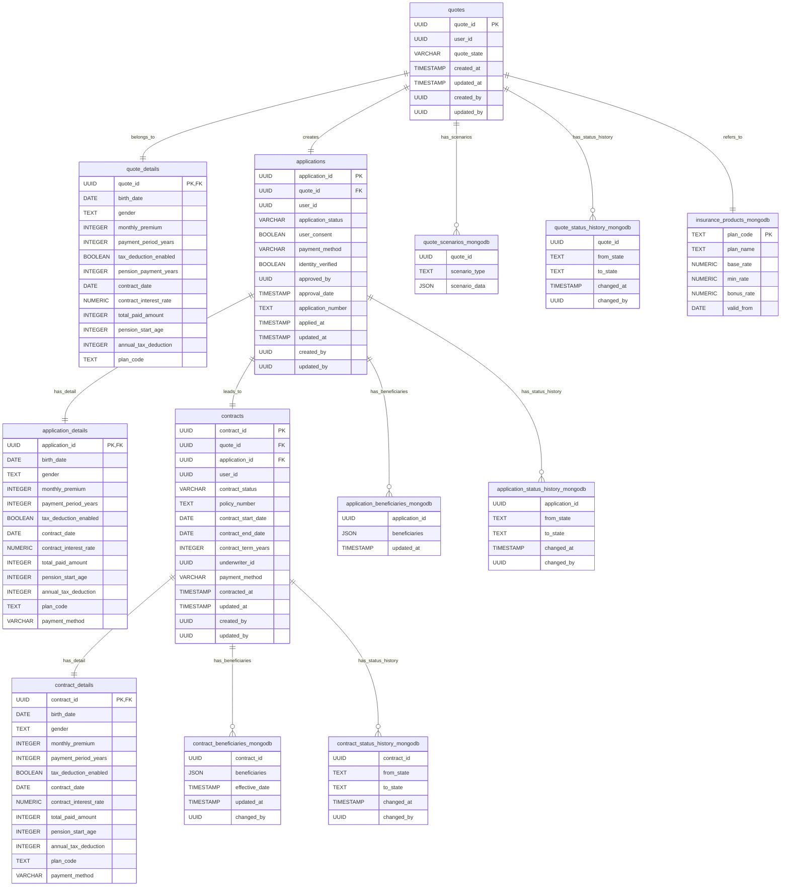

# DB構成

## ER図

```mermaid
erDiagram

quotes {
    UUID quote_id PK
    UUID user_id
    VARCHAR quote_state
    TIMESTAMP created_at
    TIMESTAMP updated_at
    UUID created_by
    UUID updated_by
}

quote_details {
    UUID quote_id PK,FK
    DATE birth_date
    TEXT gender
    INTEGER monthly_premium
    INTEGER payment_period_years
    BOOLEAN tax_deduction_enabled
    INTEGER pension_payment_years
    DATE contract_date
    NUMERIC contract_interest_rate
    INTEGER total_paid_amount
    INTEGER pension_start_age
    INTEGER annual_tax_deduction
    TEXT plan_code
}

applications {
    UUID application_id PK
    UUID quote_id FK
    UUID user_id
    VARCHAR application_status
    BOOLEAN user_consent
    VARCHAR payment_method
    BOOLEAN identity_verified
    UUID approved_by
    TIMESTAMP approval_date
    TEXT application_number
    TIMESTAMP applied_at
    TIMESTAMP updated_at
    UUID created_by
    UUID updated_by
}

application_details {
    UUID application_id PK,FK
    DATE birth_date
    TEXT gender
    INTEGER monthly_premium
    INTEGER payment_period_years
    BOOLEAN tax_deduction_enabled
    DATE contract_date
    NUMERIC contract_interest_rate
    INTEGER total_paid_amount
    INTEGER pension_start_age
    INTEGER annual_tax_deduction
    TEXT plan_code
    VARCHAR payment_method
}

contracts {
    UUID contract_id PK
    UUID quote_id FK
    UUID application_id FK
    UUID user_id
    VARCHAR contract_status
    TEXT policy_number
    DATE contract_start_date
    DATE contract_end_date
    INTEGER contract_term_years
    UUID underwriter_id
    VARCHAR payment_method
    TIMESTAMP contracted_at
    TIMESTAMP updated_at
    UUID created_by
    UUID updated_by
}

contract_details {
    UUID contract_id PK,FK
    DATE birth_date
    TEXT gender
    INTEGER monthly_premium
    INTEGER payment_period_years
    BOOLEAN tax_deduction_enabled
    DATE contract_date
    NUMERIC contract_interest_rate
    INTEGER total_paid_amount
    INTEGER pension_start_age
    INTEGER annual_tax_deduction
    TEXT plan_code
    VARCHAR payment_method
}

application_beneficiaries_mongodb {
    UUID application_id
    JSON beneficiaries
    TIMESTAMP updated_at
}

contract_beneficiaries_mongodb {
    UUID contract_id
    JSON beneficiaries
    TIMESTAMP effective_date
    TIMESTAMP updated_at
    UUID changed_by
}

quote_scenarios_mongodb {
    UUID quote_id
    TEXT scenario_type
    JSON scenario_data
}

quote_status_history_mongodb {
    UUID quote_id
    TEXT from_state
    TEXT to_state
    TIMESTAMP changed_at
    UUID changed_by
}

application_status_history_mongodb {
    UUID application_id
    TEXT from_state
    TEXT to_state
    TIMESTAMP changed_at
    UUID changed_by
}

contract_status_history_mongodb {
    UUID contract_id
    TEXT from_state
    TEXT to_state
    TIMESTAMP changed_at
    UUID changed_by
}

insurance_products_mongodb {
    TEXT plan_code PK
    TEXT plan_name
    NUMERIC base_rate
    NUMERIC min_rate
    NUMERIC bonus_rate
    DATE valid_from
}

quotes ||--|| quote_details : belongs_to
quotes ||--|| applications : creates
applications ||--|| application_details : has_detail
applications ||--|| contracts : leads_to
contracts ||--|| contract_details : has_detail

applications ||--o{ application_beneficiaries_mongodb : has_beneficiaries
contracts ||--o{ contract_beneficiaries_mongodb : has_beneficiaries

quotes ||--o{ quote_scenarios_mongodb : has_scenarios
quotes ||--o{ quote_status_history_mongodb : has_status_history
applications ||--o{ application_status_history_mongodb : has_status_history
contracts ||--o{ contract_status_history_mongodb : has_status_history

quotes ||--|| insurance_products_mongodb : refers_to
```