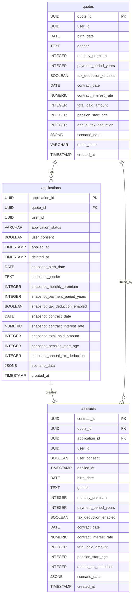

# DB構成

## ER図




## DDLテンプレート

### 🟦 PostgreSQL用 DDL（マークダウン形式）

* 見積もり情報を格納するテーブル

```sql
DROP TABLE IF EXISTS quotes;

CREATE TABLE quotes (
    quote_id UUID PRIMARY KEY,                         -- 見積もりID
    user_id UUID NOT NULL,                             -- ユーザーID（Keycloakのsub）

    -- ユーザーの契約条件
    birth_date DATE NOT NULL,                          -- 生年月日
    gender TEXT NOT NULL CHECK (gender IN ('male', 'female', 'other')),
    monthly_premium INTEGER NOT NULL,                  -- 月額保険料
    payment_period_years INTEGER NOT NULL,             -- 支払い年数
    tax_deduction_enabled BOOLEAN NOT NULL,            -- 税制適格特約の有無

    -- 見積もり計算結果
    contract_date DATE NOT NULL,                       -- 契約開始日
    contract_interest_rate NUMERIC(5,2) NOT NULL,      -- 契約利率（誤差対策）
    total_paid_amount INTEGER NOT NULL,                -- 支払総額
    pension_start_age INTEGER NOT NULL,                -- 年金開始年齢
    annual_tax_deduction INTEGER NOT NULL,             -- 年間控除額

    -- シナリオ（jsonb配列）
    scenario_data JSONB NOT NULL,                      -- 複数の利率シナリオ

    -- ステータス
    quote_state VARCHAR(32) DEFAULT 'none' CHECK (
        quote_state IN ('none', 'applied', 'cancelled')
    ),

    -- レコード作成日
    created_at TIMESTAMP DEFAULT CURRENT_TIMESTAMP
);
```

* 申し込み情報を格納するテーブル

```sql
DROP TABLE IF EXISTS applications;

CREATE TABLE applications (
    application_id UUID PRIMARY KEY,                   -- 申込ID

    quote_id UUID NOT NULL REFERENCES quotes(quote_id) ON DELETE CASCADE,
    user_id UUID NOT NULL,                             -- ユーザーID

    -- ステータス管理
    application_status VARCHAR(32) DEFAULT 'none' CHECK (
        application_status IN ('none', 'applied', 'reverted', 'cancelled')
    ),

    -- ユーザー同意とタイムスタンプ
    user_consent BOOLEAN NOT NULL,
    applied_at TIMESTAMP WITHOUT TIME ZONE NOT NULL,
    deleted_at TIMESTAMP WITHOUT TIME ZONE,

    -- スナップショット：契約条件
    snapshot_birth_date DATE NOT NULL,
    snapshot_gender TEXT NOT NULL CHECK (snapshot_gender IN ('male', 'female', 'other')),
    snapshot_monthly_premium INTEGER NOT NULL,
    snapshot_payment_period_years INTEGER NOT NULL,
    snapshot_tax_deduction_enabled BOOLEAN NOT NULL,

    -- スナップショット：見積もり計算結果
    snapshot_contract_date DATE NOT NULL,
    snapshot_contract_interest_rate NUMERIC(5,2) NOT NULL,
    snapshot_total_paid_amount INTEGER NOT NULL,
    snapshot_pension_start_age INTEGER NOT NULL,
    snapshot_annual_tax_deduction INTEGER NOT NULL,

    -- シナリオ
    scenario_data JSONB NOT NULL,

    -- レコード作成日
    created_at TIMESTAMP DEFAULT CURRENT_TIMESTAMP
);
```

```sql
DROP TABLE IF EXISTS contracts;

CREATE TABLE contracts (
    contract_id UUID PRIMARY KEY,

    quote_id UUID NOT NULL REFERENCES quotes(quote_id) ON DELETE CASCADE,
    application_id UUID NOT NULL REFERENCES applications(application_id) ON DELETE CASCADE,
    user_id UUID NOT NULL,

    -- ユーザー同意とタイムスタンプ
    user_consent BOOLEAN NOT NULL,
    applied_at TIMESTAMP WITHOUT TIME ZONE NOT NULL,

    -- ユーザー契約条件
    birth_date DATE NOT NULL,
    gender TEXT NOT NULL CHECK (gender IN ('male', 'female', 'other')),
    monthly_premium INTEGER NOT NULL,
    payment_period_years INTEGER NOT NULL,
    tax_deduction_enabled BOOLEAN NOT NULL,

    -- 見積もり計算結果
    contract_date DATE NOT NULL,
    contract_interest_rate NUMERIC(5,2) NOT NULL,
    total_paid_amount INTEGER NOT NULL,
    pension_start_age INTEGER NOT NULL,
    annual_tax_deduction INTEGER NOT NULL,

    -- シナリオ
    scenario_data JSONB NOT NULL,

    -- レコード作成日
    created_at TIMESTAMP DEFAULT CURRENT_TIMESTAMP
);
```

---

### 🟩 MongoDB用 スキーマ定義

**保険商品情報**

db: 

```
insurance
```

data:
```json
{
  plan_id: str,
  name: str,
  description: str,
  image_key: str
}
```

sampledata登録

* sampledata登録
```javascript
use insurance;

db.plans.insertMany([
   {
     plan_id: "pension001",
     name: "個人年金保険",
     description: "老後の生活資金を確保するための保険です。",
     image_key: "pension001.jpg"
   },
   {
     plan_id: "education001",
     name: "学資保険",
     description: "お子様の教育資金を準備するための保険です。",
     image_key: "education001.jpg"
   }
]);
```

**金利データ**

db: 

```
rate_db
```

data:
```json
{
    "product_type": str,
    "rate_type": str,
    "rate": float,
    "start_date": ISODate("date"),
    "end_date": ISODate("date"),
    "guaranteed_minimum_rate": float
  },
```

sampledata登録
```javascript
use rate_db;

db.interest_rates.insertMany([
  {
    "product_type": "pension",
    "rate_type": "contract",
    "rate": 1.2,
    "start_date": ISODate("2025-01-01"),
    "end_date": ISODate("2030-12-31"),
    "guaranteed_minimum_rate": 0.5
  },
  {
    "product_type": "pension",
    "rate_type": "contract",
    "rate": 1.3,
    "start_date": ISODate("2031-01-01"),
    "end_date": ISODate("2045-12-31"),
    "guaranteed_minimum_rate": 0.5
  }
]);
```

---
