# DB設計

## DDL出力用 プロンプトテンプレート（mermaid & openapi => DDL）

あなたは、モバイルアプリおよびマイクロサービスアーキテクチャ、データベース管理に精通したプロフェッショナルなソフトウェア、データベースアーキテクトです。

以下に示すMermaid形式のシーケンス図と、Openapiファイルをもとに、RDB(PostgreSQL)およびMongoDBの**DDL(マークダウン形式)**を出力してください。出力対象は、Mermaid形式のシーケンス図中に登場する各DB（MongoDB (商品データ)やRDB (見積もりデータ)など）です。

- 各DDLに対して、説明文を入れてわかりやすくしてください。
- 出力するDDLになった理由(データ形式や、項目)の説明を別途出力してください。

もし前提条件や不明点がある場合は、出力前に**質問リストを提示**してください。

## ER図



## DDLテンプレート

### 🟦 PostgreSQL用 DDL（マークダウン形式）

```sql
-- ユーザー見積もり情報を保持するテーブル
CREATE TABLE quotes (
    quote_id VARCHAR(64) PRIMARY KEY,
    user_id VARCHAR(64) NOT NULL,
    plan_id VARCHAR(64) NOT NULL,
    payment_period INTEGER NOT NULL,
    monthly_premium INTEGER NOT NULL,
    refund_condition VARCHAR(255),
    expected_refund INTEGER NOT NULL,
    interest_rate_snapshot FLOAT NOT NULL,
    valid_until TIMESTAMP NOT NULL,
    created_at TIMESTAMP DEFAULT CURRENT_TIMESTAMP
);
```

```sql
-- 保険申込データを管理するテーブル
CREATE TABLE applications (
    application_id VARCHAR(64) PRIMARY KEY,
    quote_id VARCHAR(64) NOT NULL REFERENCES quotes(quote_id),
    user_id VARCHAR(64) NOT NULL,
    application_status VARCHAR(32) NOT NULL CHECK (application_status IN ('pending', 'submitted', 'deleted')),
    user_consent BOOLEAN NOT NULL DEFAULT FALSE,
    applied_at TIMESTAMP DEFAULT CURRENT_TIMESTAMP,
    deleted_at TIMESTAMP
);
```

```sql
-- 保険契約情報を保持するテーブル
CREATE TABLE contracts (
    contract_id VARCHAR(64) PRIMARY KEY,
    application_id VARCHAR(64) NOT NULL REFERENCES applications(application_id),
    user_id VARCHAR(64) NOT NULL,
    contract_start_date DATE NOT NULL,
    contract_end_date DATE,
    plan_id VARCHAR(64) NOT NULL,
    agreed_rate FLOAT NOT NULL,
    agreed_premium INTEGER NOT NULL,
    contract_terms TEXT
);
```

---

### 🟩 MongoDB用 スキーマ定義例（JSON風）

#### `plans` コレクション（保険商品プラン）

```json
{
  "plan_id": "pension001",
  "name": "個人年金保険",
  "description": "老後の生活資金を確保するための保険です。",
  "image_key": "pension001.jpg",
  "rates_by_period": [
    { "start_date": "2025-01-01", "end_date": "2025-12-31", "interest_rate": 1.5 },
    { "start_date": "2026-01-01", "interest_rate": 1.3 }
  ]
}
```

---

#### `notifications` コレクション（お知らせ）

```json
{
  "message_id": "notif001",
  "title": "重要なお知らせ",
  "content": "保険料が改定されます。",
  "published_at": "2025-06-01T00:00:00Z",
  "expires_at": "2025-12-31T00:00:00Z"
}
```

---

#### `user_notifications_status` コレクション（既読管理）

```json
{
  "user_id": "user_abc123",
  "read_message_ids": ["notif001", "notif002"]
}
```

---

#### `user_settings` コレクション（ユーザー設定）

```json
{
  "user_id": "user_abc123",
  "settings": {
    "email_subscription": true,
    "notification_sound": false,
    "dark_mode": true
  }
}
```

---

### 🧠 スキーマ設計の背景と選定理由

#### ✅ PostgreSQL（RDB）採用理由

| テーブル           | 理由                                   |
| -------------- | ------------------------------------ |
| `quotes`       | トランザクション管理が必要（計算値、履歴の一貫性保持）          |
| `applications` | 申込ステータス・同一ユーザーの複数申込を整合的に管理する必要があるため  |
| `contracts`    | 明確な契約履歴・期間管理・金額情報が必要なため。RDBで整合性保証が容易 |

* 各テーブルには `user_id` を保持し、Keycloakとのユーザー識別連携を担保
* `interest_rate_snapshot` など、変動する参照情報は冗長に保持して一貫性を確保

---

#### ✅ MongoDB（NoSQL）採用理由

| コレクション                      | 理由                                    |
| --------------------------- | ------------------------------------- |
| `plans`                     | 商品情報が階層・配列構造（利率履歴含む）を持ち、柔軟性が求められる     |
| `notifications`             | 一括配信で多数の読み込みアクセスがあるため、スキーマの柔軟性と拡張性が必要 |
| `user_notifications_status` | ユーザーごとに「お知らせの既読一覧」を持つため、更新・検索の柔軟性が必要  |
| `user_settings`             | 設定項目が今後変化・増加する可能性があり、スキーマレスな保存が望ましい   |

---