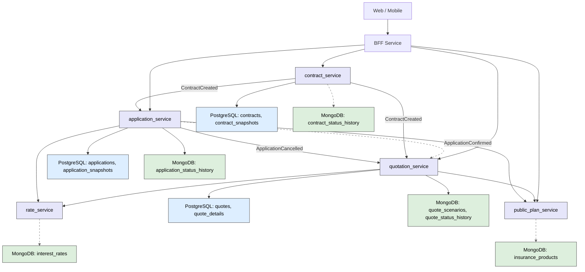

## サービス一覧と連携方式
| サービス名                   | 主な責務            | 主DB                                       | 外部連携方式              |
| ----------------------- | --------------- | ----------------------------------------- | ------------------- |
| `bff_service`           | api統合、認証・認可（Keycloak）    | Keycloak          | REST (各サービスと連携)、OpenID Connect     |
| `auth_service`          | 認証・認可（Keycloak） | Keycloak                                  | OpenID Connect      |
| `quotation_service`     | 保険見積もり作成・更新     | PostgreSQL（quotes 等）、MongoDB（scenarios 等） | REST + NATS（サブスク）   |
| `application_service`   | 申込処理管理          | PostgreSQL、MongoDB                        | REST + NATS（パブリッシュ） |
| `contract_service`      | 契約管理            | PostgreSQL、MongoDB                        | REST + NATS（パブリッシュ） |
| `rate_service`          | 利率データ取得         | MongoDB（interest\_rates）                  | REST                |
| `public_plan_service`  | 商品マスタ情報の取得      | MongoDB（insurance\_products）              | REST                |
| `event_log_service` | イベント監査ログ        | MongoDB or S3                             | バッチ         |

## 構成図

