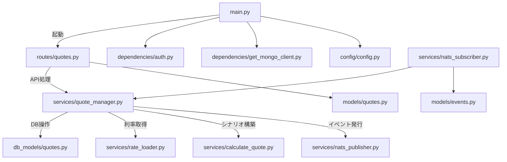
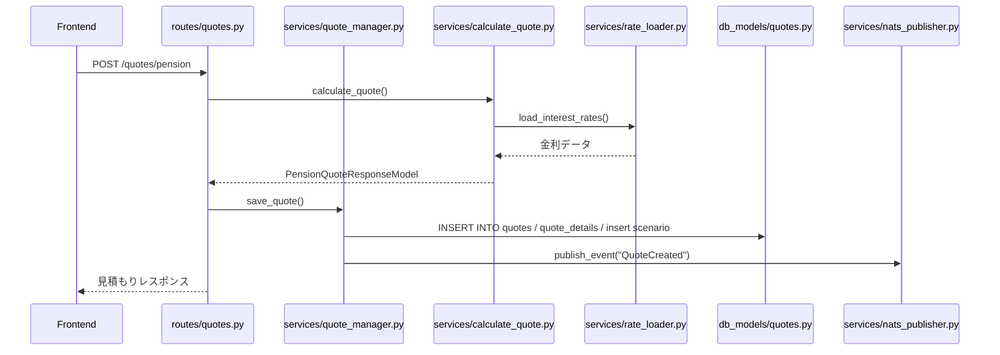

## モジュール構造図

```mermaid
graph TD
  Main[main.py] -->|起動| Router[routes/quotes.py]
  Router -->|API処理| QuoteManager[services/quote_manager.py]
  QuoteManager -->|DB操作| DBModel[db_models/quotes.py]
  QuoteManager -->|利率取得| RateLoader[services/rate_loader.py]
  QuoteManager -->|シナリオ構築| CalculateQuote[services/calculate_quote.py]
  QuoteManager -->|イベント発行| NatsPublisher[services/nats_publisher.py]
  Main --> Auth[dependencies/auth.py]
  Main --> Mongo[dependencies/get_mongo_client.py]
  Main --> Config[config/config.py]
  NatsSubscriber[services/nats_subscriber.py] --> QuoteManager
  NatsSubscriber --> Events[models/events.py]
  Router --> QuoteModel[models/quotes.py]
```

## シーケンス図（例：POST /quotes/pension）

```mermaid
sequenceDiagram
  participant FE as Frontend
  participant API as routes/quotes.py
  participant QM as services/quote_manager.py
  participant CQ as services/calculate_quote.py
  participant RL as services/rate_loader.py
  participant DB as db_models/quotes.py
  participant NP as services/nats_publisher.py

  FE->>API: POST /quotes/pension
  API->>CQ: calculate_quote()
  CQ->>RL: load_interest_rates()
  RL-->>CQ: 金利データ
  CQ-->>API: PensionQuoteResponseModel
  API->>QM: save_quote()
  QM->>DB: INSERT INTO quotes / quote_details / insert scenario
  QM->>NP: publish_event("QuoteCreated")
  API-->>FE: 見積もりレスポンス
```