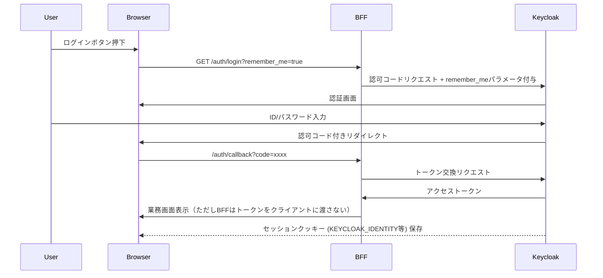

# レベルアップ

## user_service

| 分類 | 改善ポイント |
|---|---|
| アーキテクチャ設計 | PKCE実装 |
| セッション管理 | セッション保存とCookie反映タイミングを統合（RedirectResponse後のCookie書き換えは不安定） |
| セッション管理 | セッションスライディング延長（アクセス都度TTL更新） |
| セッション管理 | セッション構造に version 属性付与（将来的な拡張容易化） |
| セキュリティ | RedisのACL設定・暗号化・VPC内配置で安全性強化 |
| セキュリティ | refresh_tokenを暗号化して保存（Redis漏洩リスク低減） |
| セキュリティ | CSRFトークン導入（特にPOST系API用） |
| 可用性 | Redis高可用化構成（Redis ClusterまたはSentinel） |
| 障害耐性 | KeycloakのDiscovery endpoint死活監視 |
| 保守性 | 設定ファイルをPydanticのBaseSettings等で型安全化 |
| 保守性 | OIDCClientのエラーハンドリング統一化（例外クラス化） |
| 監視運用 | セッション数・リフレッシュ回数・認証失敗件数等のメトリクスをPrometheus連携 |
| ユーザ体験 | トークン期限直前の自動更新のリトライ耐性（通信失敗時の一時待機等） |

