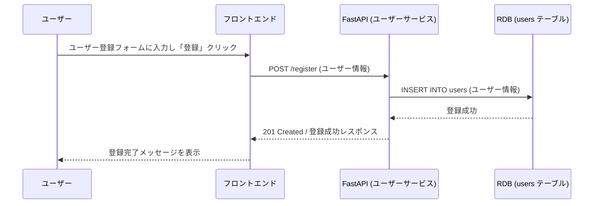
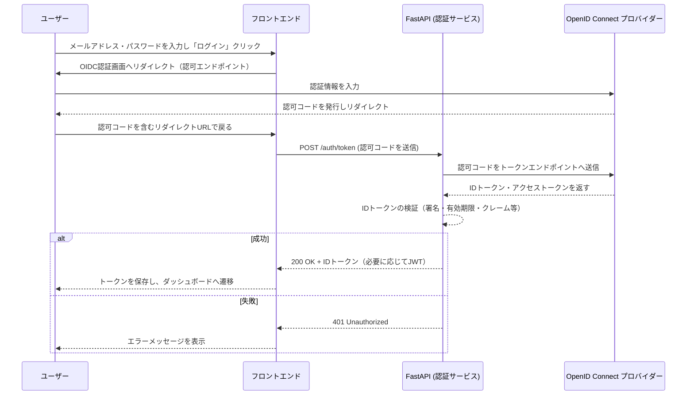
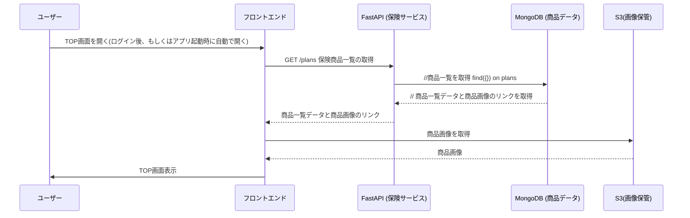
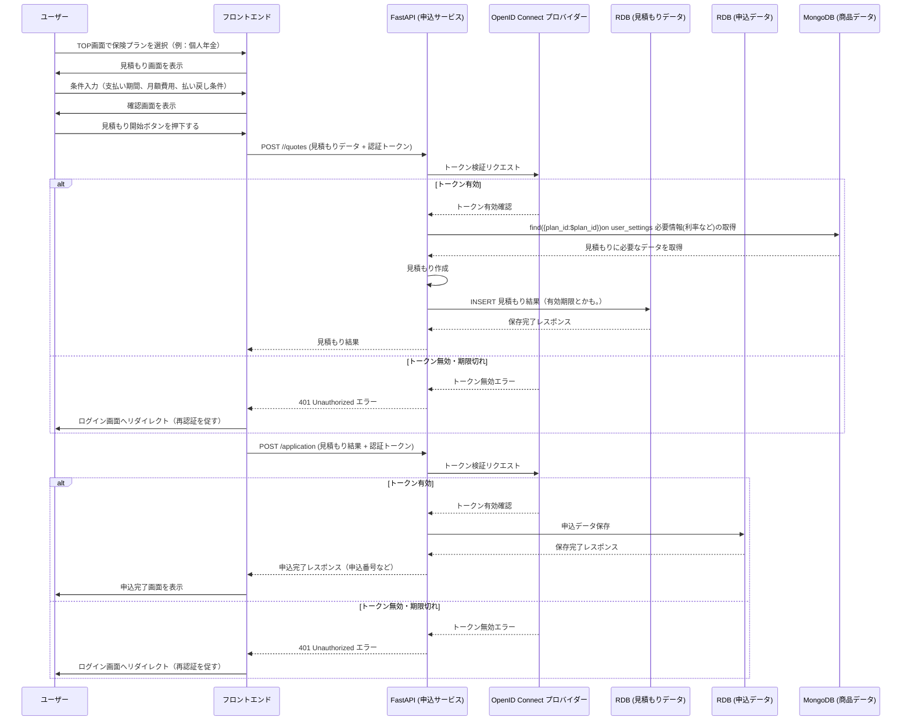
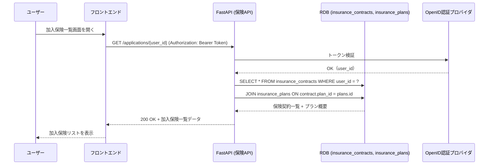
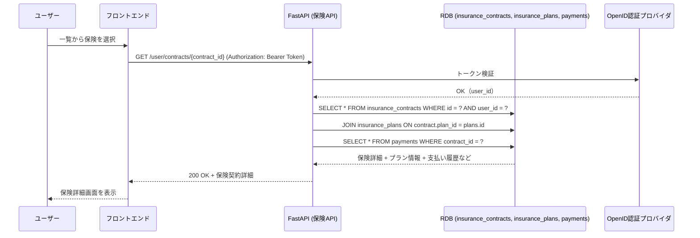
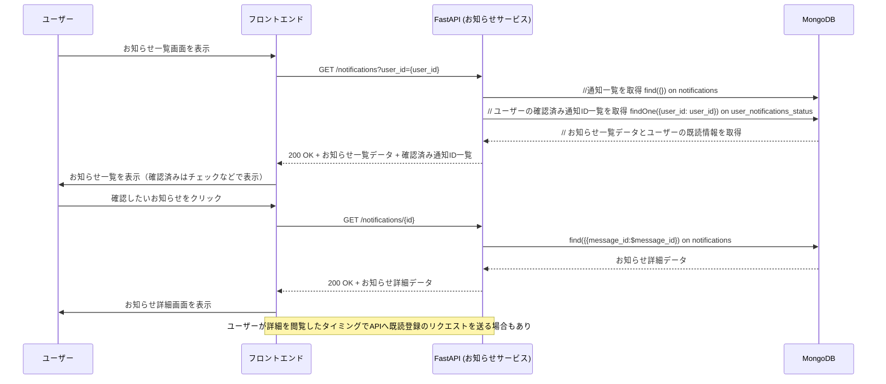
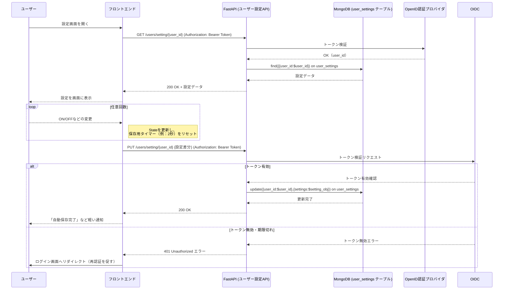

# シーケンス

WEBサイトもスマホアプリも同様の流れになるよう設計する。

## ユーザ登録

```mermaid
sequenceDiagram
    participant User as ユーザー
    participant Frontend as フロントエンド
    participant API as FastAPI (ユーザーサービス)
    participant DB as RDB (users テーブル)

    User->>Frontend: ユーザー登録フォームに入力し「登録」クリック
    Frontend->>API: POST /register (ユーザー情報)
    API->>DB: INSERT INTO users (ユーザー情報)
    DB-->>API: 登録成功
    API-->>Frontend: 201 Created / 登録成功レスポンス
    Frontend-->>User: 登録完了メッセージを表示
```

## ログイン

```mermaid
sequenceDiagram
    participant User as ユーザー
    participant Frontend as フロントエンド
    participant API as FastAPI (認証サービス)
    participant OIDC as OpenID Connect プロバイダー

    User->>Frontend: メールアドレス・パスワードを入力し「ログイン」クリック
    Frontend->>User: OIDC認証画面へリダイレクト（認可エンドポイント）
    User->>OIDC: 認証情報を入力
    OIDC-->>User: 認可コードを発行しリダイレクト
    User->>Frontend: 認可コードを含むリダイレクトURLで戻る
    Frontend->>API: POST /auth/token (認可コードを送信)
    API->>OIDC: 認可コードをトークンエンドポイントへ送信
    OIDC-->>API: IDトークン・アクセストークンを返す
    API-->>API: IDトークンの検証（署名・有効期限・クレーム等）
    alt 成功
        API-->>Frontend: 200 OK + IDトークン（必要に応じてJWT）
        Frontend-->>User: トークンを保存し、ダッシュボードへ遷移
    else 失敗
        API-->>Frontend: 401 Unauthorized
        Frontend-->>User: エラーメッセージを表示
    end
```

## 保険商品の一覧を取得

```mermaid
sequenceDiagram
    participant User as ユーザー
    participant Frontend as フロントエンド
    participant API as FastAPI (保険サービス)
    participant DB as MongoDB (商品データ)
    participant S3 as S3(画像保管)

    User->>Frontend: TOP画面を開く(ログイン後、もしくはアプリ起動時に自動で開く) 
    Frontend->>API: GET /plans 保険商品一覧の取得
    API->>DB: //商品一覧を取得 find({}) on plans
    DB-->>API:// 商品一覧データと商品画像のリンクを取得
    API-->>Frontend:商品一覧データと商品画像のリンク
    Frontend->>S3:商品画像を取得
    S3-->>Frontend:商品画像
    Frontend->>User: TOP画面表示
```

## 完全新規で保険加入を行う

```mermaid
sequenceDiagram
    participant User as ユーザー
    participant Frontend as フロントエンド
    participant API as FastAPI (申込サービス)
    participant OIDC as OpenID Connect プロバイダー
    participant DB1 as RDB (見積もりデータ)
    participant DB2 as RDB (申込データ)
    participant DB3 as MongoDB (商品データ)

    User->>Frontend: TOP画面で保険プランを選択（例：個人年金）
    Frontend->>User: 見積もり画面を表示
    User->>Frontend: 条件入力（支払い期間、月額費用、払い戻し条件）
    Frontend->>User: 確認画面を表示
    User->>Frontend: 見積もり開始ボタンを押下する
    Frontend->>API: POST //quotes (見積もりデータ + 認証トークン)
    API->>OIDC: トークン検証リクエスト
    alt トークン有効
        OIDC-->>API: トークン有効確認
        API->>DB3: find({plan_id:$plan_id})on user_settings 必要情報(利率など)の取得
        DB3-->>API:見積もりに必要なデータを取得
        API->>API:見積もり作成
        API->>DB1:INSERT 見積もり結果（有効期限とかも。）
        DB1-->>API: 保存完了レスポンス
        API-->>Frontend: 見積もり結果
    else トークン無効・期限切れ
        OIDC-->>API: トークン無効エラー
        API-->>Frontend: 401 Unauthorized エラー
        Frontend->>User: ログイン画面へリダイレクト（再認証を促す）
    end
    Frontend->>API: POST /application (見積もり結果 + 認証トークン)
    API->>OIDC: トークン検証リクエスト
    alt トークン有効
        OIDC-->>API: トークン有効確認
        API->>DB2: 申込データ保存
        DB2-->>API: 保存完了レスポンス
        API-->>Frontend: 申込完了レスポンス（申込番号など）
        Frontend->>User: 申込完了画面を表示
    else トークン無効・期限切れ
        OIDC-->>API: トークン無効エラー
        API-->>Frontend: 401 Unauthorized エラー
        Frontend->>User: ログイン画面へリダイレクト（再認証を促す）
    end
```

## 加入している保険一覧表示

```mermaid
sequenceDiagram
    participant User as ユーザー
    participant Frontend as フロントエンド
    participant API as FastAPI (保険API)
    participant RDB as RDB (insurance_contracts, insurance_plans)
    participant Auth as OpenID認証プロバイダ

    User->>Frontend: 加入保険一覧画面を開く
    Frontend->>API: GET /applications/{user_id} (Authorization: Bearer Token)
    API->>Auth: トークン検証
    Auth-->>API: OK（user_id）
    API->>RDB: SELECT * FROM insurance_contracts WHERE user_id = ?
    API->>RDB: JOIN insurance_plans ON contract.plan_id = plans.id
    RDB-->>API: 保険契約一覧 + プラン概要
    API-->>Frontend: 200 OK + 加入保険一覧データ
    Frontend-->>User: 加入保険リストを表示
```

## 保険詳細確認

```mermaid
sequenceDiagram
    participant User as ユーザー
    participant Frontend as フロントエンド
    participant API as FastAPI (保険API)
    participant RDB as RDB (insurance_contracts, insurance_plans, payments)
    participant Auth as OpenID認証プロバイダ

    User->>Frontend: 一覧から保険を選択
    Frontend->>API: GET /user/contracts/{contract_id} (Authorization: Bearer Token)
    API->>Auth: トークン検証
    Auth-->>API: OK（user_id）
    API->>RDB: SELECT * FROM insurance_contracts WHERE id = ? AND user_id = ?
    API->>RDB: JOIN insurance_plans ON contract.plan_id = plans.id
    API->>RDB: SELECT * FROM payments WHERE contract_id = ?
    RDB-->>API: 保険詳細 + プラン情報 + 支払い履歴など
    API-->>Frontend: 200 OK + 保険契約詳細
    Frontend-->>User: 保険詳細画面を表示
```

## お知らせチェック

```mermaid
sequenceDiagram
    participant User as ユーザー
    participant Frontend as フロントエンド
    participant API as FastAPI (お知らせサービス)
    participant MongoDB as MongoDB

    User->>Frontend: お知らせ一覧画面を表示
    Frontend->>API: GET /notifications?user_id={user_id}
    API->>MongoDB://通知一覧を取得 find({}) on notifications
    API->>MongoDB:// ユーザーの確認済み通知ID一覧を取得 findOne({user_id: user_id}) on user_notifications_status
    MongoDB-->>API:// お知らせ一覧データとユーザーの既読情報を取得
    API-->>Frontend:200 OK + お知らせ一覧データ + 確認済み通知ID一覧
    Frontend->>User: お知らせ一覧を表示（確認済みはチェックなどで表示）
    User->>Frontend: 確認したいお知らせをクリック
    Frontend->>API: GET /notifications/{id}
    API->>MongoDB: find({{message_id:$message_id}) on notifications
    MongoDB-->>API: お知らせ詳細データ
    API-->>Frontend: 200 OK + お知らせ詳細データ
    Frontend->>User: お知らせ詳細画面を表示

    Note over Frontend, API:ユーザーが詳細を閲覧したタイミングでAPIへ既読登録のリクエストを送る場合もあり
```

## 個人設定

```mermaid
sequenceDiagram
    participant User as ユーザー
    participant Frontend as フロントエンド
    participant API as FastAPI (ユーザー設定API)
    participant RDB as MongoDB (user_settings テーブル)
    participant Auth as OpenID認証プロバイダ

    %% 初期設定取得
    User->>Frontend: 設定画面を開く
    Frontend->>API: GET /users/setting/{user_id} (Authorization: Bearer Token)
    API->>Auth: トークン検証
    Auth-->>API: OK（user_id）
    API->>RDB: find({{user_id:$user_id}) on user_settings
    RDB-->>API: 設定データ
    API-->>Frontend: 200 OK + 設定データ
    Frontend-->>User: 設定を画面に表示

    %% ユーザーが設定変更
    loop 任意回数
        User-->>Frontend: ON/OFFなどの変更
        note right of Frontend: Stateを更新し、<br>保存用タイマー（例：2秒）をリセット
    end

    %% 一定時間操作がない場合のみ送信
    Frontend->>API: PUT /users/setting/{user_id} {設定差分} (Authorization: Bearer Token)
    API->>OIDC: トークン検証リクエスト
    alt トークン有効
        OIDC-->>API: トークン有効確認
        API->>RDB: update({user_id:$user_id},{settings:$setting_obj}) on user_settings
        RDB-->>API: 更新完了
        API-->>Frontend: 200 OK
        Frontend-->>User: 「自動保存完了」など軽い通知
    else トークン無効・期限切れ
        OIDC-->>API: トークン無効エラー
        API-->>Frontend: 401 Unauthorized エラー
        Frontend->>User: ログイン画面へリダイレクト（再認証を促す）
    end
```