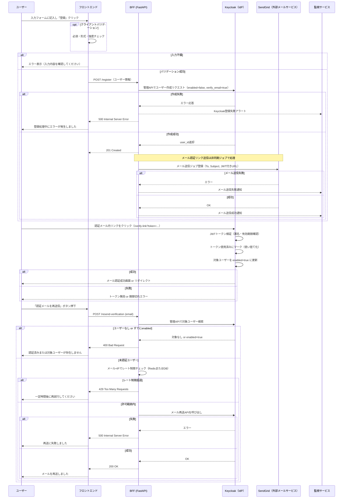
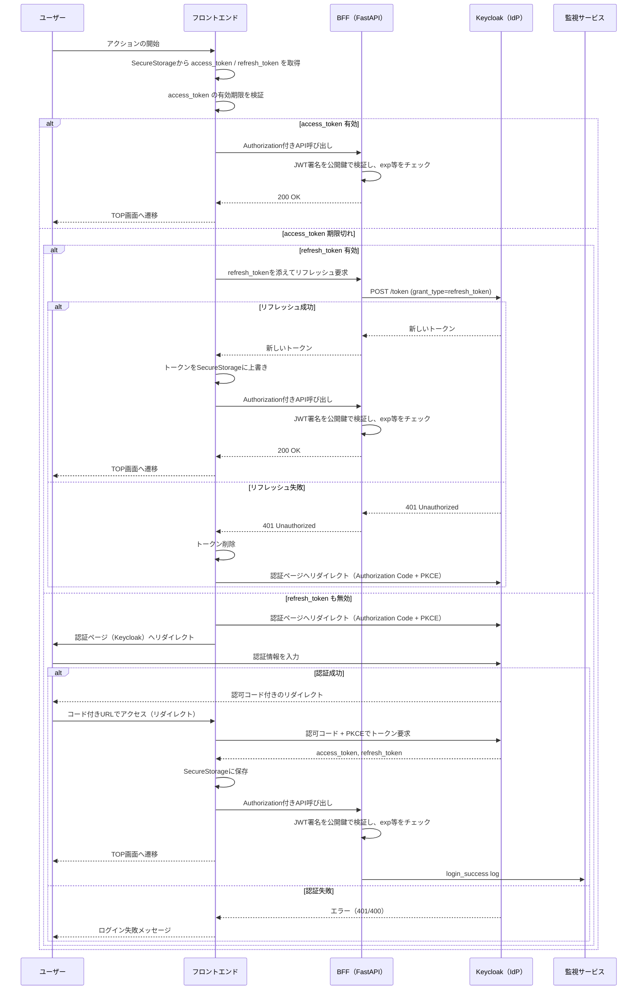
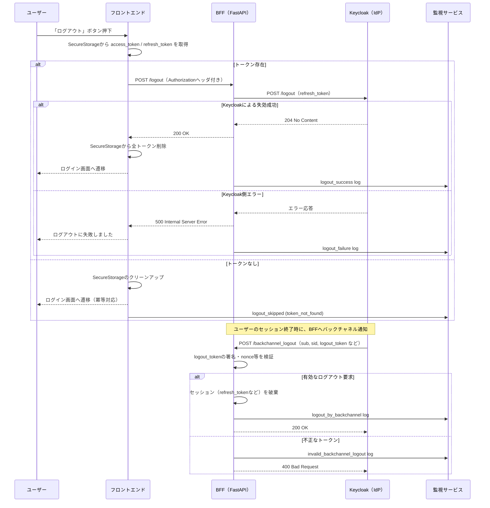
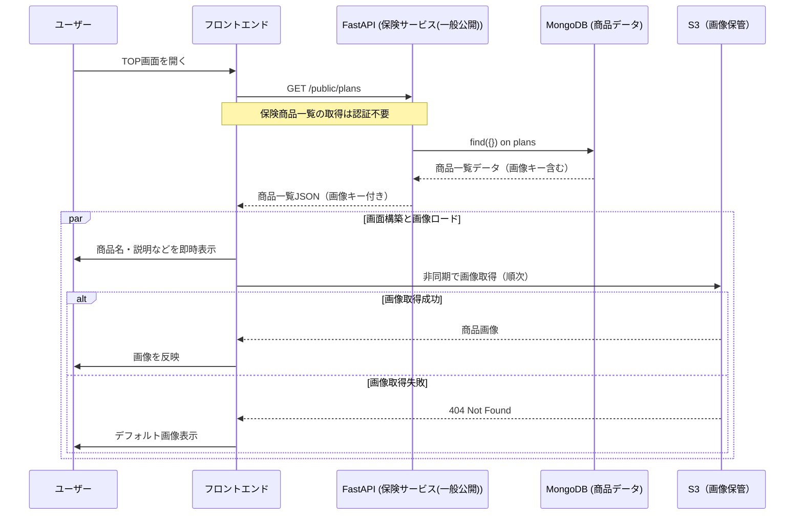
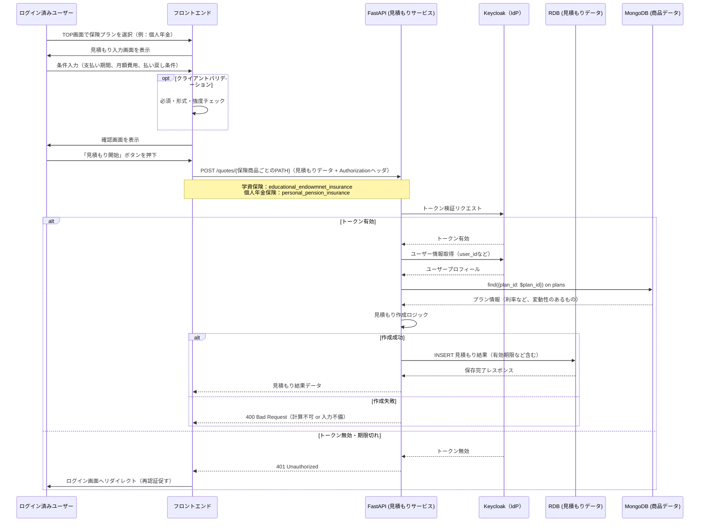
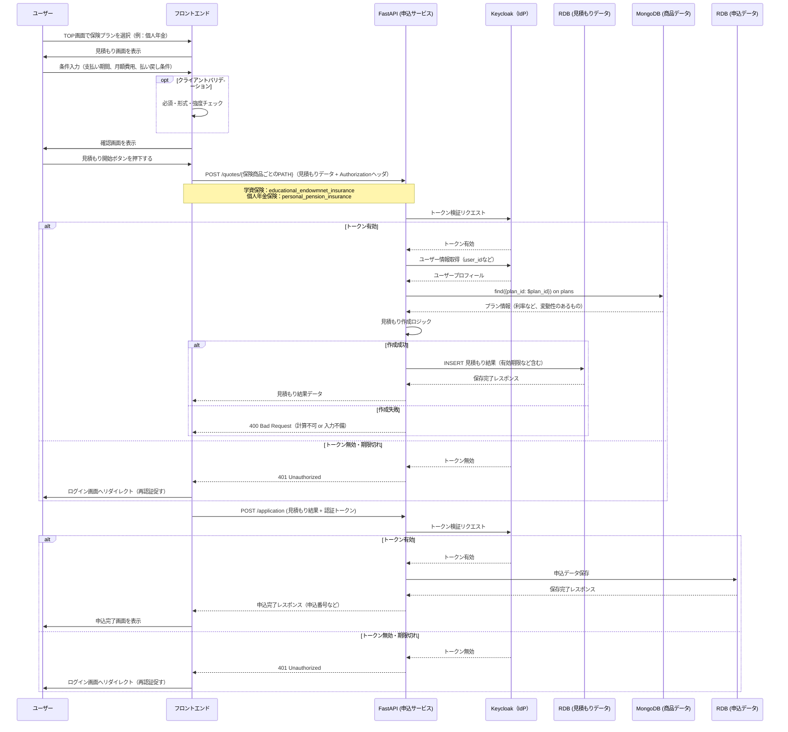
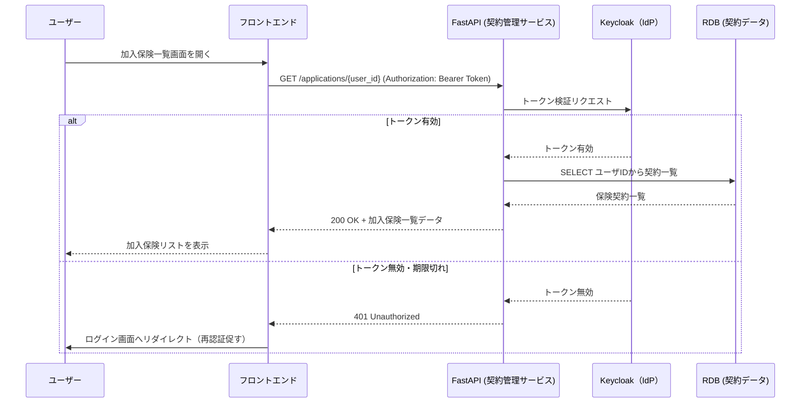
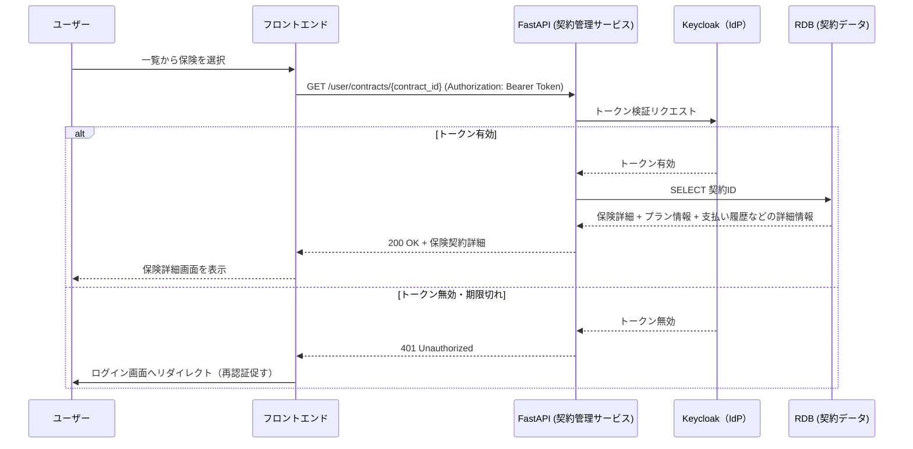
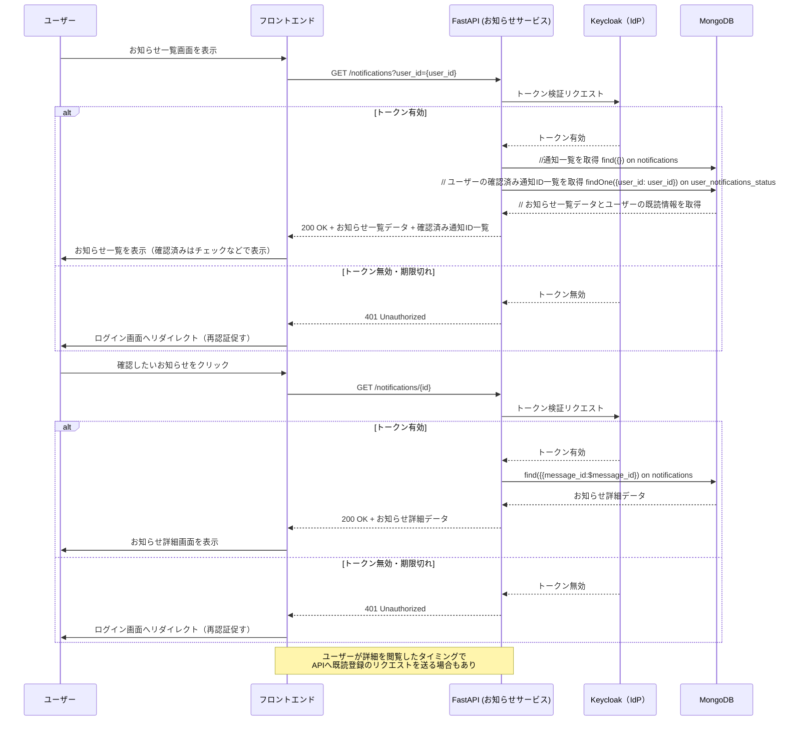
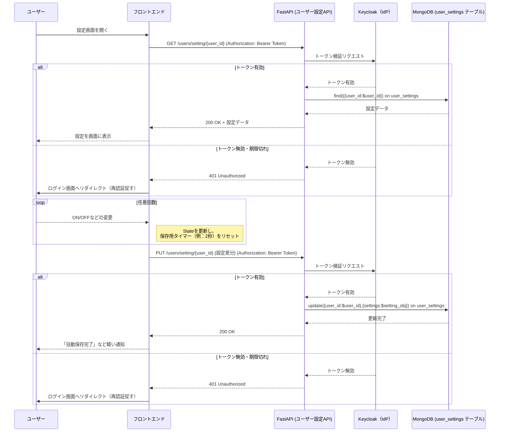

# シーケンス

WEBサイトもスマホアプリも同様の流れになるよう設計する。

## プロンプトテンプレート

あなたは、**モバイルアプリおよびマイクロサービスアーキテクチャに精通したプロフェッショナルなソフトウェアアーキテクト**です。

以下に示すのは、私が作成した保険アプリにおける【◯◯機能】（例：見積もり、申込など）の**Mermaid形式のシーケンス図**です。
この図に対して、\*\*設計レビュー（RV）\*\*をお願いします。

レビューでは、以下の観点に沿って\*\*具体的な指摘と改善提案（可能ならコード例付き）\*\*を提示してください：

#### 📌 レビュー観点

1. **表現の正確性**
   　・通信の順序、呼び出し方式（同期/非同期）、戻り値の扱い、用語の一貫性など

2. **アクターとコンポーネントの役割の妥当性**
   　・責務の分離や配置が適切か（例：BFFやAPI Gateway、モバイルアプリの責務範囲）

3. **漏れ・冗長のチェック**
   　・必要な処理が抜けていないか、または不要な手順が含まれていないか

4. **モバイルアプリおよびモダンアーキテクチャのベストプラクティスとの整合性**
   　・例：レスポンスの設計、ネットワーク負荷の最適化、BFFの導入効果、セキュリティ考慮など

5. **非同期処理／エラーハンドリングの明示性**
   　・失敗時の分岐、タイムアウト、リトライ戦略の可視化がされているか

6. **その他改善点**
   　・ドキュメントとしてのわかりやすさ、図の見やすさ、チームでの共有に適しているか

#### 🧾 アウトプット期待形式

* 各観点ごとの**5点満点評価**とコメント
* **改善提案されたMermaidコード（あれば）**
* **次に進むべきか / 修正継続すべきか**のアドバイス

#### メモ
* バックエンドはFastAPI + Keycloak、フロントエンドはiOS APPおよびWEBブラウザを想定しています。

## ユーザ登録

## ログイン

## ログアウト

## 保険商品を閲覧する

## 保険見積もりのみ

## 保険契約申込（見積もり→契約の流れ）

## 加入している保険一覧表示

## 保険詳細確認

## お知らせチェック

## 個人設定

