# シーケンス

WEBサイトもスマホアプリも同様の流れになるよう設計する。

## プロンプトテンプレート

あなたは、**モバイルアプリおよびマイクロサービスアーキテクチャに精通したプロフェッショナルなソフトウェアアーキテクト**です。

以下に示すのは、私が作成した保険アプリにおける【◯◯機能】（例：見積もり、申込など）の**Mermaid形式のシーケンス図**です。
この図に対して、\*\*設計レビュー（RV）\*\*をお願いします。

レビューでは、以下の観点に沿って\*\*具体的な指摘と改善提案（可能ならコード例付き）\*\*を提示してください：

#### 📌 レビュー観点

1. **表現の正確性**
   　・通信の順序、呼び出し方式（同期/非同期）、戻り値の扱い、用語の一貫性など

2. **アクターとコンポーネントの役割の妥当性**
   　・責務の分離や配置が適切か（例：BFFやAPI Gateway、モバイルアプリの責務範囲）

3. **漏れ・冗長のチェック**
   　・必要な処理が抜けていないか、または不要な手順が含まれていないか

4. **モバイルアプリおよびモダンアーキテクチャのベストプラクティスとの整合性**
   　・例：レスポンスの設計、ネットワーク負荷の最適化、BFFの導入効果、セキュリティ考慮など

5. **非同期処理／エラーハンドリングの明示性**
   　・失敗時の分岐、タイムアウト、リトライ戦略の可視化がされているか

6. **その他改善点**
   　・ドキュメントとしてのわかりやすさ、図の見やすさ、チームでの共有に適しているか

#### 🧾 アウトプット期待形式

* 各観点ごとの**5点満点評価**とコメント
* **改善提案されたMermaidコード（あれば）**
* **次に進むべきか / 修正継続すべきか**のアドバイス

#### メモ
* バックエンドはFastAPI + Keycloak、フロントエンドはiOS APPおよびWEBブラウザを想定しています。

## ユーザ登録

```mermaid
sequenceDiagram
    participant User as ユーザー
    participant Frontend as フロントエンド
    participant BFF as BFF (FastAPI)
    participant Keycloak as Keycloak（IdP）
    participant SendGrid as SendGrid（外部メールサービス）
    participant Monitoring as 監視サービス

    %% --- ユーザー登録処理開始 ---
    User->>Frontend: 入力フォームに記入し「登録」クリック

    opt クライアントバリデーション
        Frontend->>Frontend: 必須・形式・強度チェック
    end

    alt 入力不備
        Frontend-->>User: エラー表示（入力内容を確認してください）
    else バリデーション成功
        Frontend->>BFF: POST /register（ユーザー情報）

        BFF->>Keycloak: 管理APIでユーザー作成リクエスト（enabled=false, verify_email=true）
        alt 作成失敗
            Keycloak-->>BFF: エラー応答
            BFF-->>Monitoring: Keycloak登録失敗アラート
            BFF-->>Frontend: 500 Internal Server Error
            Frontend-->>User: 登録処理中にエラーが発生しました
        else 作成成功
            Keycloak-->>BFF: user_id返却
            BFF-->>Frontend: 201 Created

            Note over BFF,SendGrid: メール認証リンク送信は非同期ジョブで処理
            BFF->>SendGrid: メール送信ジョブ登録（To, Subject, JWT付きURL）
            
            alt メール送信失敗
                SendGrid-->>BFF: エラー
                BFF-->>Monitoring: メール送信失敗通知
            else 成功
                SendGrid-->>BFF: OK
                BFF-->>Monitoring: メール送信成功通知
            end
        end
    end

    %% --- メール認証処理 ---
    User->>Keycloak: 認証メール内リンクをクリック（/verify-link?token=...）

    Keycloak->>Keycloak: JWTトークン検証（署名・有効期限確認）
    Keycloak->>Keycloak: トークン使用済みにマーク（使い捨て化）
    Keycloak->>Keycloak: 対象ユーザーを enabled=true に更新

    alt 成功
        Keycloak-->>User: メール認証成功画面 or リダイレクト
    else 失敗
        Keycloak-->>User: トークン無効 or 期限切れエラー
    end

    %% --- 認証メール再送処理 ---
    User->>Frontend: 「認証メールを再送信」ボタン押下
    Frontend->>BFF: POST /resend-verification (email)

    BFF->>Keycloak: 管理APIで対象ユーザー検索
    alt ユーザーなし or すでにenabled
        Keycloak-->>BFF: 対象なし or enabled=true
        BFF-->>Frontend: 400 Bad Request
        Frontend-->>User: 認証済みまたは対象ユーザーが存在しません
    else 未認証ユーザー
        BFF->>BFF: メール+IPでレート制限チェック（RedisまたはDB）

        alt レート制限超過
            BFF-->>Frontend: 429 Too Many Requests
            Frontend-->>User: 一定時間後に再試行してください
        else 許可範囲内
            BFF->>Keycloak: メール再送APIを呼び出し
            alt 失敗
                Keycloak-->>BFF: エラー
                BFF-->>Frontend: 500 Internal Server Error
                Frontend-->>User: 再送に失敗しました
            else 成功
                Keycloak-->>BFF: OK
                BFF-->>Frontend: 200 OK
                Frontend-->>User: メールを再送しました
            end
        end
    end

```

## ログイン

```mermaid
sequenceDiagram
    participant User as ユーザー
    participant Frontend as フロントエンド
    participant BFF as BFF（FastAPI）
    participant Keycloak as Keycloak（IdP）
    participant Monitoring as 監視サービス

    %% --- アプリ起動時の認証チェック ---
    User->>Frontend: アクションの開始
    Frontend->>Frontend: SecureStorageから access_token / refresh_token を取得
    Frontend->>Frontend: access_token の有効期限を検証

    alt access_token 有効
        Frontend->>BFF: Authorization付きAPI呼び出し
        BFF->>BFF: JWT署名を公開鍵で検証し、exp等をチェック
        BFF-->>Frontend: 200 OK
        Frontend-->>User: TOP画面へ遷移

    else access_token 期限切れ
        alt refresh_token 有効
            Frontend->>BFF: refresh_tokenを添えてリフレッシュ要求
            BFF->>Keycloak: POST /token (grant_type=refresh_token)
            alt リフレッシュ成功
                Keycloak-->>BFF: 新しいトークン
                BFF-->>Frontend: 新しいトークン
                Frontend->>Frontend: トークンをSecureStorageに上書き
                Frontend->>BFF: Authorization付きAPI呼び出し
                BFF->>BFF: JWT署名を公開鍵で検証し、exp等をチェック
                BFF-->>Frontend: 200 OK
                Frontend-->>User: TOP画面へ遷移
            else リフレッシュ失敗
                Keycloak-->>BFF: 401 Unauthorized
                BFF-->>Frontend: 401 Unauthorized
                Frontend->>Frontend: トークン削除
                Frontend->>Keycloak: 認証ページへリダイレクト（Authorization Code + PKCE）
            end

        else refresh_token も無効
            Frontend->>Keycloak: 認証ページへリダイレクト（Authorization Code + PKCE）
            %% --- 初回または手動ログイン ---
            Frontend->>User: 認証ページ（Keycloak）へリダイレクト
            User->>Keycloak: 認証情報を入力
            alt 認証成功
                Keycloak-->>User: 認可コード付きのリダイレクト
                User->>Frontend: コード付きURLでアクセス（リダイレクト）
                Frontend->>Keycloak: 認可コード + PKCEでトークン要求
                Keycloak-->>Frontend: access_token, refresh_token
                Frontend->>Frontend: SecureStorageに保存
                Frontend->>BFF: Authorization付きAPI呼び出し
                BFF->>BFF: JWT署名を公開鍵で検証し、exp等をチェック
                Frontend-->>User: TOP画面へ遷移
                BFF->>Monitoring: login_success log
            else 認証失敗
                Keycloak-->>Frontend: エラー（401/400）
                Frontend-->>User: ログイン失敗メッセージ
            end
        end
    end
```

## ログアウト

```mermaid
sequenceDiagram
    participant User as ユーザー
    participant Frontend as フロントエンド
    participant BFF as BFF（FastAPI）
    participant Keycloak as Keycloak（IdP）
    participant Monitoring as 監視サービス

    %% --- ユーザーがログアウト操作を実行 ---
    User->>Frontend: 「ログアウト」ボタン押下
    Frontend->>Frontend: SecureStorageから access_token / refresh_token を取得

    alt トークン存在
        Frontend->>BFF: POST /logout（Authorizationヘッダ付き）
        BFF->>Keycloak: POST /logout（refresh_token）

        alt Keycloakによる失効成功
            Keycloak-->>BFF: 204 No Content
            BFF-->>Frontend: 200 OK
            Frontend->>Frontend: SecureStorageから全トークン削除
            Frontend-->>User: ログイン画面へ遷移
            BFF->>Monitoring: logout_success log
        else Keycloak側エラー
            Keycloak-->>BFF: エラー応答
            BFF-->>Frontend: 500 Internal Server Error
            Frontend-->>User: ログアウトに失敗しました
            BFF->>Monitoring: logout_failure log
        end

    else トークンなし
        Frontend->>Frontend: SecureStorageのクリーンアップ
        Frontend-->>User: ログイン画面へ遷移（冪等対応）
        Frontend->>Monitoring: logout_skipped (token_not_found)
    end

    %% --- KeycloakからのBackchannel Logoutトリガー ---
    Note over Keycloak,BFF: ユーザーのセッション終了時に、BFFへバックチャネル通知
    Keycloak->>BFF: POST /backchannel_logout（sub, sid, logout_token など）

    BFF->>BFF: logout_tokenの署名・nonce等を検証
    alt 有効なログアウト要求
        BFF->>BFF: セッション（refresh_tokenなど）を破棄
        BFF->>Monitoring: logout_by_backchannel log
        BFF-->>Keycloak: 200 OK
    else 不正なトークン
        BFF->>Monitoring: invalid_backchannel_logout log
        BFF-->>Keycloak: 400 Bad Request
    end
```

## 保険商品を閲覧する

```mermaid
sequenceDiagram
    participant User as ユーザー
    participant Frontend as フロントエンド
    participant API as FastAPI (public_plans_service)
    participant DB as MongoDB（商品データ）<br>db: insurance<br>collection: plans
    participant S3 as S3（画像ストレージ）<br>bucket: insurance-app-public-img

    User->>Frontend: TOP画面を開く

    Frontend->>API: GET /api/v1/public/plans
    Note over Frontend,API: 保険商品一覧の取得は認証不要
    API->>DB: collection.find()
    DB-->>API: 保険商品一覧データ<br>plan_id, name, description, image_key
    API->>API: JSON形式に整形
    API-->>Frontend: 保険商品一覧JSON

    par 商品一覧のUI構築と画像ロード
        Frontend->>User: 商品名・説明などを即時表示（テキスト）
        Frontend->>S3: 画像取得リクエスト（非同期）
        alt 画像取得成功
            S3-->>Frontend: 商品画像バイナリ
            Frontend->>User: DOMに画像を反映
        else 画像取得失敗
            S3-->>Frontend: 404 Not Found
            Frontend->>User: デフォルト画像を表示
        end
    end
```

## 保険見積もりのみ

```mermaid
sequenceDiagram
    participant User as ログイン済みユーザー
    participant Frontend as フロントエンド
    participant BFFAPI as BFF (API Gateway)
    participant API as FastAPI (quotation_service)
    participant Keycloak as Keycloak（IdP）
    participant RDB as QuoteRDB (見積もりデータ)
    participant MongoDB as MongoDB（利率データ）<br>db: rate_db<br>collection: interest_rates

    User->>Frontend: TOP画面で保険プランを選択（例：個人年金）
    Frontend->>User: 見積もり入力画面を表示
    User->>Frontend: 条件入力 <br> 契約者の生年月日、性別、月額保険料、払込期間、個人年金保険料税制適格特約の有無
    opt クライアントバリデーション
        Frontend->>Frontend: 必須・形式・強度チェック
    end
    Frontend->>User: 確認画面を表示
    User->>Frontend: 「見積もり開始」ボタンを押下

    Frontend->>BFFAPI: POST /api/v1/quotes/{保険商品ごとのPATH} <br> 見積もりデータ + session id
    Note over Frontend,BFFAPI: 学資保険：education <br>個人年金保険：pension
    BFFAPI->>BFFAPI: session idより、AccessTokenとRefreshTokenを取得
    BFFAPI->>Keycloak: Token検証用の公開鍵を取得
    Keycloak-->>BFFAPI: 公開鍵
    BFFAPI->>BFFAPI: AccessTokenの検証
    alt AccessToken有効
        BFFAPI->>API: POST /api/v1/quotes/{保険商品ごとのPATH} <br> 見積もりデータ + AuthorizationヘッダにAccessToken 
        API->>Keycloak: Token検証用の公開鍵を取得
        Keycloak-->>API: 公開鍵
        API->>API: AccessTokenの検証および、実行権限の確認(認可) 
        alt AccessToken有効
            API->>MongoDB: collection.find_one(start_date,end_date, rate_type, product_type)
            MongoDB-->>API: プラン情報（最低保証利率、予定利率）
            API->>API: 見積もり作成ロジック
            alt 作成成功
                API->>RDB: INSERT 見積もり結果
                RDB-->>API: 保存完了レスポンス
                API-->>Frontend: 見積もり結果データ
        else 作成失敗
            API-->>Frontend: 400 Bad Request（計算不可 or 入力不備）
        end
        else AccessToken無効・期限切れ
            API-->BFFAPI: 401 Unauthorized
        end
    else AccessToken無効・期限切れ
        BFFAPI->>BFFAPI: RefreshTokenの期限検証
        alt RefreshToken有効
            BFFAPI->>Keycloak: AccessToken発行リクエスト
            Keycloak-->>BFFAPI: AccessToken発行
        else RefreshToken無効
            BFFAPI-->>Frontend: 401 Unauthorized
            Frontend->>User: ログイン画面へリダイレクト（再認証促す）
        end
    end
```

## 保険契約申込（既存の見積もり情報をもとに契約申し込み）

```mermaid
sequenceDiagram
    participant User as ログイン済みユーザー
    participant Frontend as フロントエンド
    participant BFFAPI as BFF (API Gateway)
    participant API as FastAPI (application_service)
    participant API2 as FastAPI (quotation_service)
    participant Keycloak as Keycloak（IdP）
    participant RDB as ApplicationRDB (申込データ)
    participant RDB2 as QuoteRDB (見積もりデータ)
    participant MongoDB as MongoDB（利率データ）<br>db: rate_db<br>collection: interest_rates

    Frontend->>User: 見積もりプランを表示（見積もりからそのまま申し込みor過去の見積もり一覧から選択の2パターン）
    User->>Frontend: 申し込みボタンを押下

    Frontend->>BFFAPI: POST /api/v1/applications/{quote_id} <br> session id
    BFFAPI->>BFFAPI: session idより、AccessTokenとRefreshTokenを取得
    BFFAPI->>Keycloak: Token検証用の公開鍵を取得
    Keycloak-->>BFFAPI: 公開鍵
    BFFAPI->>BFFAPI: AccessTokenの検証
    alt AccessToken有効
        BFFAPI->>API: POST /api/v1/applications/{quote_id} <br> 見積もりデータ + AuthorizationヘッダにAccessToken 
        API->>API2: GET /api/v1/quote/{quote_id} + AuthorizationヘッダにAccessToken 
        API2-->API: 見積もり結果データ
        API->>API: 申し込み可能かチェック
        API->>API2: PUT /api/v1/quote/{quote_id} + AuthorizationヘッダにAccessToken <br>申し込み済みに変更
        API2->>RDB2: UPDATE stateをappliedへ変更
        RDB2-->>API2: 保存完了レスポンス
        API->>RDB: INSERT 申し込み情報
        RDB-->>API: 保存完了レスポンス
        API-->>BFFAPI:申込完了レスポンス（申込番号など）
        BFFAPI-->>Frontend: 申込完了レスポンス（申込番号など）
        Frontend->>User: 申込完了画面を表示
    else トークン無効・期限切れ
        Keycloak-->>BFFAPI: トークン無効
        BFFAPI-->>Frontend: 401 Unauthorized
        Frontend->>User: ログイン画面へリダイレクト（再認証促す）
    end
```

## 加入している保険一覧表示

```mermaid
sequenceDiagram
    participant User as ユーザー
    participant Frontend as フロントエンド
    participant API as FastAPI (契約管理サービス)
    participant Keycloak as Keycloak（IdP）
    participant RDB as RDB (契約データ)

    User->>Frontend: 加入保険一覧画面を開く
    Frontend->>API: GET /applications/{user_id} (Authorization: Bearer Token)
    API->>Keycloak: トークン検証リクエスト
    alt トークン有効
        Keycloak-->>API: トークン有効
        API->>RDB: SELECT ユーザIDから契約一覧
        RDB-->>API: 保険契約一覧
        API-->>Frontend: 200 OK + 加入保険一覧データ
        Frontend-->>User: 加入保険リストを表示
    else トークン無効・期限切れ
        Keycloak-->>API: トークン無効
        API-->>Frontend: 401 Unauthorized
        Frontend->>User: ログイン画面へリダイレクト（再認証促す）
    end
```

## 保険詳細確認

```mermaid
sequenceDiagram
    participant User as ユーザー
    participant Frontend as フロントエンド
    participant API as FastAPI (契約管理サービス)
    participant Keycloak as Keycloak（IdP）
    participant RDB as RDB (契約データ)

    User->>Frontend: 一覧から保険を選択
    Frontend->>API: GET /user/contracts/{contract_id} (Authorization: Bearer Token)
    API->>Keycloak: トークン検証リクエスト
    alt トークン有効
        Keycloak-->>API: トークン有効
        API->>RDB: SELECT 契約ID
        RDB-->>API: 保険詳細 + プラン情報 + 支払い履歴などの詳細情報
        API-->>Frontend: 200 OK + 保険契約詳細
        Frontend-->>User: 保険詳細画面を表示
    else トークン無効・期限切れ
        Keycloak-->>API: トークン無効
        API-->>Frontend: 401 Unauthorized
        Frontend->>User: ログイン画面へリダイレクト（再認証促す）
    end
```

## お知らせチェック

```mermaid
sequenceDiagram
    participant User as ユーザー
    participant Frontend as フロントエンド
    participant API as FastAPI (お知らせサービス)
    participant Keycloak as Keycloak（IdP）
    participant MongoDB as MongoDB

    User->>Frontend: お知らせ一覧画面を表示
    Frontend->>API: GET /notifications?user_id={user_id}
    API->>Keycloak: トークン検証リクエスト
    alt トークン有効
        Keycloak-->>API: トークン有効
        API->>MongoDB://通知一覧を取得 find({}) on notifications
        API->>MongoDB:// ユーザーの確認済み通知ID一覧を取得 findOne({user_id: user_id}) on user_notifications_status
        MongoDB-->>API:// お知らせ一覧データとユーザーの既読情報を取得
        API-->>Frontend:200 OK + お知らせ一覧データ + 確認済み通知ID一覧
        Frontend->>User: お知らせ一覧を表示（確認済みはチェックなどで表示）
    else トークン無効・期限切れ
        Keycloak-->>API: トークン無効
        API-->>Frontend: 401 Unauthorized
        Frontend->>User: ログイン画面へリダイレクト（再認証促す）
    end
    User->>Frontend: 確認したいお知らせをクリック
    Frontend->>API: GET /notifications/{id}
    API->>Keycloak: トークン検証リクエスト
    alt トークン有効
        Keycloak-->>API: トークン有効
        API->>MongoDB: find({{message_id:$message_id}) on notifications
        MongoDB-->>API: お知らせ詳細データ
        API-->>Frontend: 200 OK + お知らせ詳細データ
        Frontend->>User: お知らせ詳細画面を表示
    else トークン無効・期限切れ
        Keycloak-->>API: トークン無効
        API-->>Frontend: 401 Unauthorized
        Frontend->>User: ログイン画面へリダイレクト（再認証促す）
    end
    Note over Frontend, API:ユーザーが詳細を閲覧したタイミングで<br>APIへ既読登録のリクエストを送る場合もあり
```

## 個人設定

```mermaid
sequenceDiagram
    participant User as ユーザー
    participant Frontend as フロントエンド
    participant API as FastAPI (ユーザー設定API)
    participant Keycloak as Keycloak（IdP）
    participant RDB as MongoDB (user_settings テーブル)

    %% 初期設定取得
    User->>Frontend: 設定画面を開く
    Frontend->>API: GET /users/setting/{user_id} (Authorization: Bearer Token)
    API->>Keycloak: トークン検証リクエスト
    alt トークン有効
        Keycloak-->>API: トークン有効
        API->>RDB: find({{user_id:$user_id}) on user_settings
        RDB-->>API: 設定データ
        API-->>Frontend: 200 OK + 設定データ
        Frontend-->>User: 設定を画面に表示
    else トークン無効・期限切れ
        Keycloak-->>API: トークン無効
        API-->>Frontend: 401 Unauthorized
        Frontend->>User: ログイン画面へリダイレクト（再認証促す）
    end

    %% ユーザーが設定変更
    loop 任意回数
        User-->>Frontend: ON/OFFなどの変更
        note right of Frontend: Stateを更新し、<br>保存用タイマー（例：2秒）をリセット
    end

    %% 一定時間操作がない場合のみ送信
    Frontend->>API: PUT /users/setting/{user_id} {設定差分} (Authorization: Bearer Token)
    API->>Keycloak: トークン検証リクエスト
    alt トークン有効
        Keycloak-->>API: トークン有効
        API->>RDB: update({user_id:$user_id},{settings:$setting_obj}) on user_settings
        RDB-->>API: 更新完了
        API-->>Frontend: 200 OK
        Frontend-->>User: 「自動保存完了」など軽い通知
    else トークン無効・期限切れ
        Keycloak-->>API: トークン無効
        API-->>Frontend: 401 Unauthorized
        Frontend->>User: ログイン画面へリダイレクト（再認証促す）
    end
```

